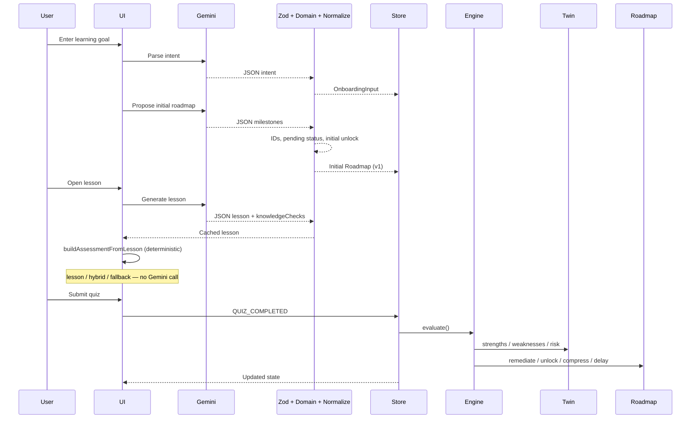

# MentorMind AI — Architecture

## Separation of responsibilities

MentorMind enforces a strict boundary between **generative content** (Gemini) and **learner progression** (deterministic Decision Engine).

```
Gemini (proposed content)
  → Zod validation
  → domain validation
  → normalization
  → deterministic initialization (IDs, status, unlock, completion defaults)
  → Initial twin / roadmap / lesson application state
        ↓
  Learner studies lesson & completes assessment
        ↓
  QUIZ_COMPLETED / INACTIVITY_TICK events
        ↓
  Decision Engine (deterministic only)
        ↓
  Twin + roadmap adaptation (weakness, remediation, unlock, compress, risk)
```

---

## Allowed vs prohibited Gemini involvement

### Allowed (content bootstrap only)

| Responsibility | Becomes application state only after |
|---|---|
| Intent parsing | Zod → `OnboardingInput` mapping |
| **Initial roadmap proposal** | Zod → domain validation → `buildRoadmapFromAiMilestones` (IDs, `pending` status, initial unlock rule, milestone dates from week numbers) |
| Lesson generation | Zod → domain validation → session cache |
| Knowledge-check questions | Embedded in validated lesson JSON (not a separate assessment API) |

**Initial roadmap generation is an allowed Gemini responsibility.** Gemini proposes milestones and tasks; the app never stores raw Gemini JSON as the roadmap. Normalization in `buildRoadmapFromAiMilestones` assigns deterministic IDs, sets all tasks to `status: "pending"`, applies the fixed first-week unlock rule, and initializes milestone status. This is **plan bootstrap**, not learner progression.

### Prohibited (post-onboarding / post-signal)

Gemini must **never** participate in post-assessment or post-engagement adaptation, including:

- Marking mastery or weakness
- Inserting remediation tasks
- Unlocking or locking tasks based on performance
- Changing milestone dates after initial bootstrap
- Changing dropout risk, consistency, or learning velocity
- Accelerating or delaying the roadmap in response to quiz/inactivity signals
- Deciding the learner's next action after performance signals

All of the above are owned exclusively by the **Decision Engine** (`src/lib/engine/`).

---

## Responsibility matrix

| Layer | Owns | Must not own |
|---|---|---|
| **Gemini** | Intent parsing, initial roadmap **proposal**, lesson prose, knowledge-check questions inside lessons | Post-signal adaptation, twin mutations, performance-driven unlock/remediation |
| **Zod validation** | Schema enforcement, clamping, rejection of malformed AI JSON | Adaptation business rules |
| **Domain validation** | Cross-domain contamination checks on AI content | Progression decisions |
| **Normalization** | Slug IDs, roadmap model shape, task defaults | Quiz-driven state changes |
| **Deterministic fallbacks** | Offline intent, seed roadmaps, generic lessons/assessments when Gemini unavailable | Performance-based progression |
| **Learning Twin** | Goal identity, preferences, strengths, weaknesses, quiz history, risk signals | Generating content or adaptation rules |
| **Roadmap model** | Milestones, tasks, unlock flags, version | Deciding **when** to adapt after signals |
| **Decision Engine** | All post-bootstrap adaptation | Content generation |
| **UI** | Display, dispatch learner events, session caches | Direct twin/roadmap mutation outside store + engine |

---

## Gemini invocation map

There are **three** direct `generateContent()` call sites:

| File | Function | Purpose |
|---|---|---|
| `src/lib/onboarding/parse-intent-ai.ts` | `parseGoalIntentWithGemini` | Natural-language goal → structured intent |
| `src/lib/ai/generate-roadmap.ts` | `generateRoadmapWithGemini` | Initial roadmap milestone **proposal** |
| `src/lib/ai/generate-lesson.ts` | `generateLessonWithGemini` | Topic lesson + section knowledge checks |

Orchestration (no direct SDK):

| File | Function | Pipeline |
|---|---|---|
| `src/lib/onboarding/parse-intent-service.ts` | `parseLearnerIntent` | Gemini → Zod → `OnboardingInput` |
| `src/lib/ai/roadmap-service.ts` | `generateRoadmapForOnboarding` | Gemini → Zod → domain validation → `buildRoadmapFromAiMilestones` → `Roadmap` |
| `src/lib/ai/lesson-service.ts` | `generateLessonForLearner` | Gemini → Zod → domain validation → `GeneratedLesson` |

---

## Initial roadmap pipeline (not progression)

```
generateRoadmapWithGemini
  → aiRoadmapResponseSchema (Zod)
  → validateAiRoadmapStructure (domain validation)
  → buildRoadmapFromAiMilestones
       • buildMilestoneId / buildTaskId / slugifyTitle (deterministic IDs)
       • milestone.status: current | upcoming (from week order)
       • task.status: "pending" (all tasks)
       • task.unlocked: milestone.week <= firstWeek (fixed bootstrap rule)
       • roadmap.version: 1
  → completeOnboardingWithRoadmap (store)
```

Performance-driven unlocks, remediation insertion, milestone delays, and compression happen **only** via Decision Engine actions after `QUIZ_COMPLETED` or `INACTIVITY_TICK`.

---

## Assessment architecture (accurate)

**There is no separate Gemini assessment API.**

Assessments are built entirely in application code:

1. **Primary source:** Validated `knowledgeCheck` entries from the lesson (`build-lesson-assessment.ts` → `extractLessonQuestions`). Each check is parsed through `assessmentQuestionSchema`; invalid entries are dropped.
2. **Supplement:** If fewer than `MIN_ASSESSMENT_QUESTIONS` valid questions remain, `buildDeterministicAssessmentQuestions` fills the gap (`source: "hybrid"`).
3. **Replace:** If domain validation fails on the assembled assessment, or no valid lesson questions exist, a full deterministic fallback set is used (`source: "fallback"`).
4. **Last resort in UI:** `use-generated-assessment.ts` catches build errors and calls `buildDeterministicTopicAssessment`.

When the lesson was AI-generated, some questions may originate from Gemini **as part of the lesson payload**, but assessment assembly is always deterministic application logic — never a Gemini call at assessment time.

Assessment `source` values: `"lesson"` | `"hybrid"` | `"fallback"`.

---

## Decision Engine map

Entry: `src/lib/engine/index.ts` → `evaluate(event, context)`

| Rule file | Trigger | Effects |
|---|---|---|
| `rules/quiz-performance.ts` | `QUIZ_COMPLETED` below threshold | Weakness, remedial tasks, milestone delay, dropout risk ↑ |
| `rules/mastery-recovery.ts` | `QUIZ_COMPLETED` mastery | Strength, remove remedial work, unlock advanced, compress roadmap |
| `rules/inactivity.ts` | `INACTIVITY_TICK` | Dropout risk ↑, shorten next task, nudge |

Application: `src/lib/engine/apply.ts` → `applyEngineResult` (sole mutator of twin/roadmap from performance signals)

Store wiring: `src/stores/use-app-store.ts` → `commitLearnerEvent` → `evaluate` → `applyEngineResult`

---

## Sequence diagram



---

## Development logging

In `NODE_ENV=development` (`src/lib/dev/architecture-log.ts`):

| Tag | When |
|---|---|
| `[Gemini] Intent parsed` | After intent parse |
| `[Gemini] Roadmap generated` | After AI roadmap proposal validated and normalized |
| `[Gemini] Lesson generated` | After AI lesson success |
| `[Assessment] Built from lesson` | After deterministic assessment assembly (includes source: lesson/hybrid/fallback) |
| `[Decision Engine] Quiz evaluated` | After `QUIZ_COMPLETED` |
| `[Decision Engine] Weakness detected` | Engine marks weakness |
| `[Decision Engine] Mastery detected` | Engine records mastery |
| `[Decision Engine] Roadmap updated` | Engine mutates roadmap post-signal |
| `[Fallback] …` | Deterministic fallback used instead of Gemini |

---

## Demo mode

AWS SAA demo uses seed twin/roadmap and predefined demo steps. Demo events still flow through the same Decision Engine — Gemini is not involved in the 42% / 95% / inactivity adaptation flow.
